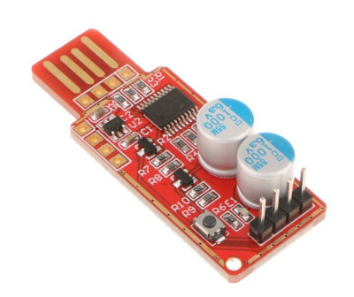

# hid-watchdog

This is a simple service to communicate with cheap USB WatchDog timers that create a USB-HID device:



## Install

### Installation on Ubuntu

Create your VirtualEnv, activate it.

```
$ pip install -r requirements.txt
```

You will need to install a library on your operating system to interface with the USB-HID device:

```
apt install libhidapi-hidraw0
```

Alternatively you may be able to use "libhidapi-libusb0" but I didn't have any success with this.
